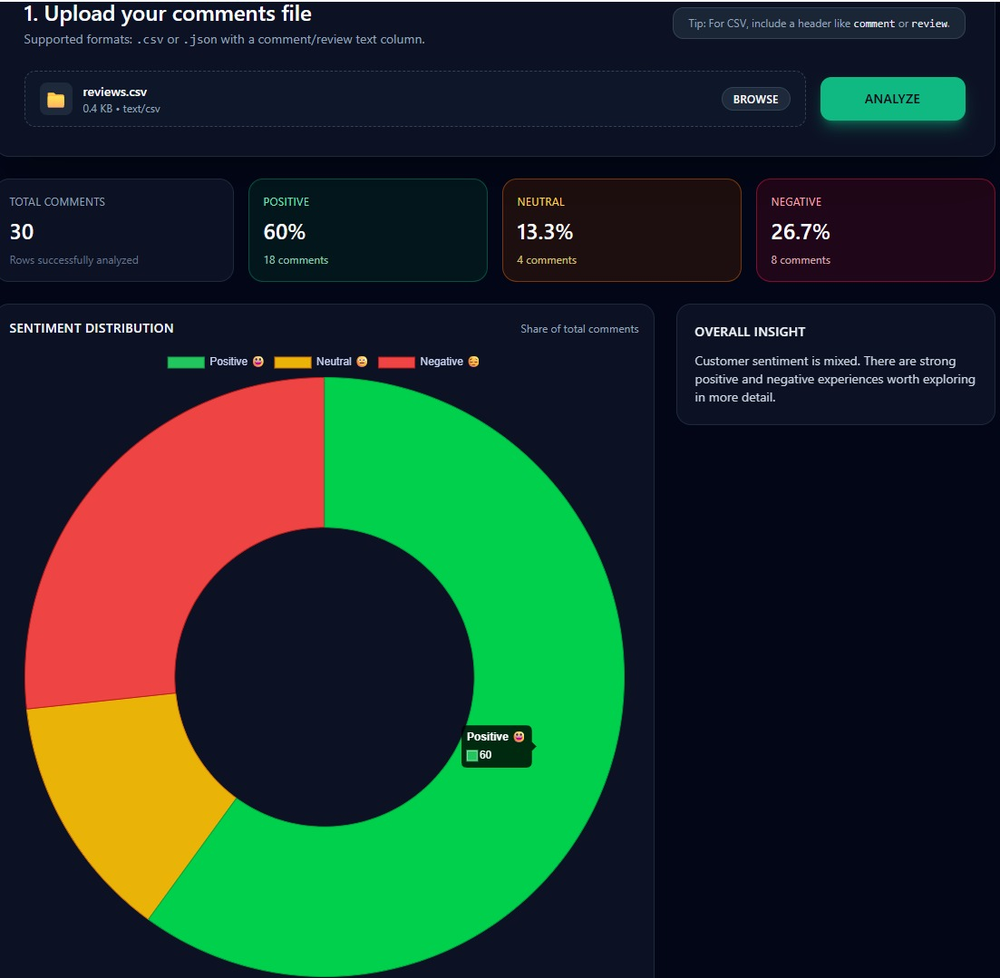
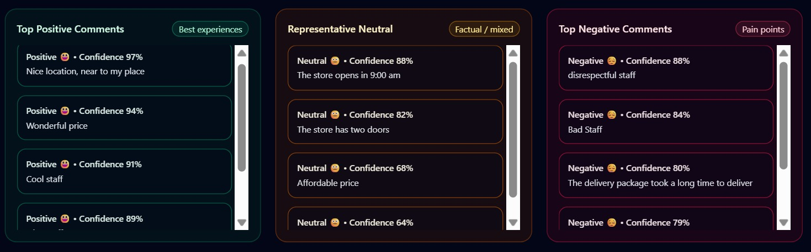
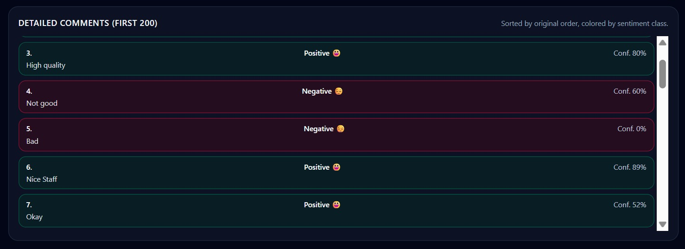
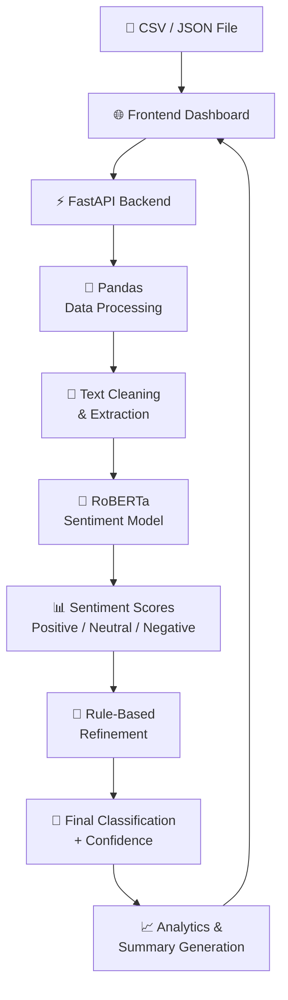

# Sentiment Text Analysis

A full-stack NLP dashboard for analyzing customer and social-media comments using a pretrained RoBERTa Transformer model. The application classifies comments as **Positive, Neutral, or Negative**, provides confidence scores, and presents the results through an interactive analytics dashboard.



## Project Overview

The **Sentiment Text Analysis** application was developed to provide a simple way to analyze large collections of text comments and extract meaningful sentiment insights.

Users can upload a **CSV or JSON file** containing comments or reviews. The application processes the text using a pretrained **Twitter-RoBERTa sentiment model**, applies additional rule-based refinement for specific edge cases, and presents the results through an interactive web dashboard.

The project combines **Natural Language Processing, machine learning inference, backend API development, data processing, and frontend visualization** into a single application.

## Key Features

* 📄 Upload comments in **CSV or JSON** format
* 🤖 Sentiment classification using a pretrained **RoBERTa Transformer**
* 📊 Classification into **Positive, Neutral, and Negative**
* 🎯 Confidence scores and class probabilities for each comment
* ⚡ Batched inference for more efficient processing
* 🧠 Rule-based refinement for short and ambiguous comments
* 🔎 Handling of factual/status-style comments
* 🚫 Basic negation handling such as `"not bad"`
* 📈 Interactive sentiment distribution visualization
* 💡 Automatically generated overall sentiment insights
* 📝 Representative positive, neutral, and negative examples
* 📋 Detailed results for individual comments
* 🔌 FastAPI backend with REST-style API endpoints

## How It Works

The application follows a multi-stage processing pipeline:

```text
CSV / JSON Upload
       │
       ▼
FastAPI File Upload
       │
       ▼
Pandas Data Processing
       │
       ▼
Text Cleaning & Extraction
       │
       ▼
RoBERTa Sentiment Model
       │
       ▼
Positive / Neutral / Negative Scores
       │
       ▼
Rule-Based Refinement
       │
       ▼
Sentiment + Confidence
       │
       ▼
Aggregated Insights
       │
       ▼
Interactive Dashboard
```

### 1. File Upload

The frontend allows users to upload either a CSV or JSON file.

For CSV files, the application can recognize common text-column names such as:

```text
comment
review
text
message
```

If none of these columns are present, the first column is used as the comment source.

### 2. Data Processing

The backend uses **Pandas** to load and prepare the uploaded data.

The text is converted to strings, whitespace is removed, and empty comments are excluded before sentiment analysis.

### 3. Transformer-Based Sentiment Analysis

The application uses the pretrained model:

```text
cardiffnlp/twitter-roberta-base-sentiment-latest
```

through the Hugging Face **Transformers** library.

The model produces sentiment probabilities that are normalized into:

* Positive
* Neutral
* Negative

The application also records the confidence associated with the final classification.

### 4. Rule-Based Refinement

In addition to the Transformer prediction, the application contains a lightweight rule-based layer.

This helps handle cases where short comments or factual statements may be difficult to classify reliably.

Examples include:

* Strong short sentiment expressions such as `"bad"` or `"excellent"`
* Factual information such as opening hours or prices
* Delivery/status messages
* Negated expressions such as `"not bad"`

This hybrid approach combines **pretrained deep-learning inference with deterministic text-processing rules**.

### 5. Dashboard Analytics

After classification, the backend aggregates the results and calculates:

* Total number of comments
* Positive / Neutral / Negative counts
* Sentiment percentages
* Representative examples for each class

These results are then displayed through the dashboard.

## Dashboard

The interface provides several views of the analysis.

### Sentiment Summary

The dashboard displays high-level KPIs showing:

* Total comments analyzed
* Positive percentage
* Neutral percentage
* Negative percentage


### Sentiment Distribution

A Chart.js doughnut chart provides a visual representation of the overall sentiment distribution.

### Representative Examples

The application extracts high-confidence examples from each sentiment category so users can quickly inspect representative customer experiences.



### Detailed Results

Individual comments are displayed with their:

* Sentiment classification
* Confidence score
* Original text

This makes it possible to move from high-level statistics to individual observations.



## Example Input

The project includes a sample CSV containing comments representing different types of sentiment and information:

```csv
comment
"The product is absolutely amazing, I love it!"
"The service was quite slow and the staff was rude."
"The store opens from 9am to 5pm every day."
"I received my order today, thank you."
"This is the worst experience I've ever had, stay away!"
```

The dataset intentionally contains positive, negative, neutral, factual, and mixed examples to demonstrate how the application handles different types of text.

## Technology Stack

### Backend

* **Python**
* **FastAPI** — API development and file handling
* **Uvicorn** — ASGI application server
* **Pandas** — data loading and preprocessing
* **python-multipart** — file upload support

### NLP / Machine Learning

* **Hugging Face Transformers**
* **PyTorch**
* **cardiffnlp/twitter-roberta-base-sentiment-latest**

### Frontend

* **HTML**
* **JavaScript**
* **Tailwind CSS**
* **Chart.js**
* **Fetch API**

## API

The FastAPI backend exposes several endpoints.

| Endpoint            | Method | Purpose                                |
| ------------------- | ------ | -------------------------------------- |
| `/`                 | GET    | Serves the dashboard                   |
| `/health`           | GET    | Health/status check                    |
| `/analyze-facebook` | POST   | Uploads and analyzes CSV/JSON comments |

The main analysis endpoint accepts an uploaded file and returns structured JSON containing the individual predictions and aggregated summary.

## Technical Highlights

This project demonstrates practical experience with:

* Integrating pretrained Transformer models into an application
* Building APIs with FastAPI
* Processing structured text data with Pandas
* Batched NLP inference
* Handling model confidence scores and class probabilities
* Combining machine-learning predictions with deterministic rules
* Designing a browser-based analytics dashboard
* Connecting a JavaScript frontend to a Python backend
* Presenting machine-learning results through interactive visualizations
* Handling multiple input formats

## Project Architecture

The application follows a layered architecture that connects the frontend dashboard with the FastAPI backend, data-processing pipeline, NLP model, and analytics layer.



### Architecture Layers

| Layer               | Technology                               | Responsibility                                                    |
| ------------------- | ---------------------------------------- | ----------------------------------------------------------------- |
| **Frontend**        | HTML, JavaScript, Tailwind CSS, Chart.js | File upload, visualization, and displaying results                |
| **API**             | FastAPI, Uvicorn                         | Handles requests, file uploads, and analysis responses            |
| **Data Processing** | Pandas                                   | Loads, cleans, and prepares comment data                          |
| **NLP Engine**      | Hugging Face Transformers, PyTorch       | Runs the pretrained RoBERTa sentiment model                       |
| **Refinement**      | Python rule-based logic                  | Handles specific short, factual, and negated expressions          |
| **Analytics**       | Python                                   | Calculates sentiment counts, percentages, examples, and summaries |
| **Output**          | JSON + Dashboard                         | Returns structured results and visual insights                    |

```
```
## Purpose

The project demonstrates how modern NLP models can be integrated into a practical application to transform unstructured text into structured sentiment insights.

Rather than exposing model predictions alone, the application combines **machine-learning inference, data processing, business-oriented summaries, and visualization** to make the results easier to interpret.

## Future Improvements

Potential future improvements include:

* Support for larger datasets through asynchronous/background processing
* Additional sentiment and emotion categories
* More advanced filtering and search capabilities
* Exporting analysis results to CSV or JSON
* Historical sentiment tracking
* Database integration for storing analyses
* Deployment to a cloud platform
* Authentication and user-specific dashboards
* More advanced multilingual sentiment support

---

## Project Status

**Completed**

The application is currently maintained as a portfolio project demonstrating full-stack development and practical NLP integration.
